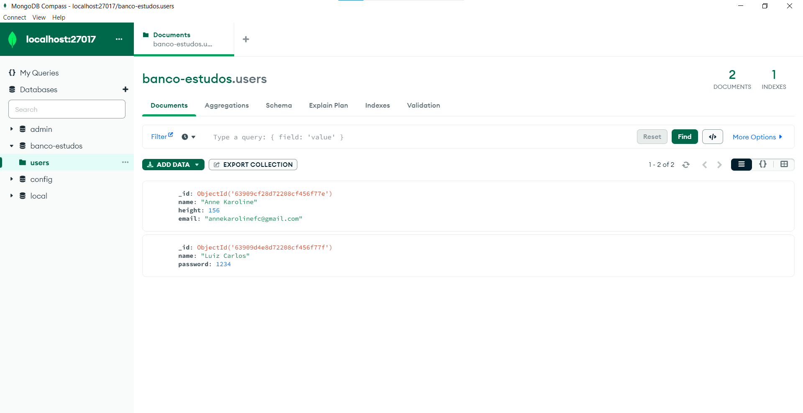

# Banco de Dados Não Relacional - MongoDB
* Extremamente rápido
* Perfeito para aplicações grandes
* Normalmente Utilizado com NodeJS

O banco de dadõs não relacional é **MUITO FLEXÍVEL**.

## Criando Banco de Dados

O **MongoDB** possui o mesmo conceito de um banco de dados que já estamos familiarizados (banco de dados relacional). Dentro do MongoDB é possível ter zero ou mais bancos de dados, cada um atuando como contêineres de alto nível.

Um banco é composto por collections: **users**



### Exibir banco de dados existentes

```
show databases
```

### Escolhe Banco de dados / Cria Banco

Pesquisa se existe. Se não existe, ele é criado.

```
use banco-estudos
```


## Criando Collections | Coleções - (semelhante a TABELAS)

Um banco de dados pode ter zero ou mais de um collections.
Uma coleção tem semelhança com uma *tabela*.

Uma collection é formada por documents: **Dois dados informados**


### Exibe as collections / tabelas existentes

```
show collections
```

### Cria uma collection

```
db.CreateCollection("NOME DA COLEÇÃO");
```

Usar o comando **show collections** para confirmar criação.

## Criando documentos

Uma coleção é composta de zero ou mais documents. 

Um documento pode ser considerado como uma **row**. Logo, documentos são **REGISTROS**.

Um documento é composto de uma ou mais fields, que você provavelmente pode imaginar serem muito parecidos com as colunas. 


Cada document é formado por fields:


### Cria um documento

```
db.NOMECOLECAO.insertOne( UM JSON AQUI....);
```

```
use blog
db.CreateCollection("Post");
db.Post.insertOne({
    "nome": "Anne Karoline",
    "conteudo": "Meu conteúdo esta sendo escrito aqui"
});
```

### Lista Todos os documentos

```
db.Posts.find();
```

### Inserindo outros tipos de dados

Exemplo com arrays:

```
use blog
db.CreateCollection("Post");
db.Post.insertOne({
    "comentarios": [2, 3, 4, 6]
});
```

### Atualizando um documento

Atualizando com dois parametros: Atual e Futuro.

```
use blog
show collections
db.CreateCollection("Post");
db.Post.updateOne({
    {nome:"Guilherme"},
    {$set:{nome:"Gustavo"}}
});
```

Usar comando para visualizar as modificações:

```
db.Posts.find({})
```

### Pesquisando por um documento


```
db.Posts.findOne({nome: "Gustavo"})
```

### Pesquisando por um array


```
db.Posts.findOne({"comentarios": {$ne:null}})

ou

db.Posts.find({"comentarios": [2, 3, 4, 6]})
```

### Deletando Documentos

Deletando um:
```
db.Posts.deleteOne({nome: "Gustavo"})
```

## Indexes

Collections pode ser indexed, o que melhora o desempenho de pesquisa e classificação.
