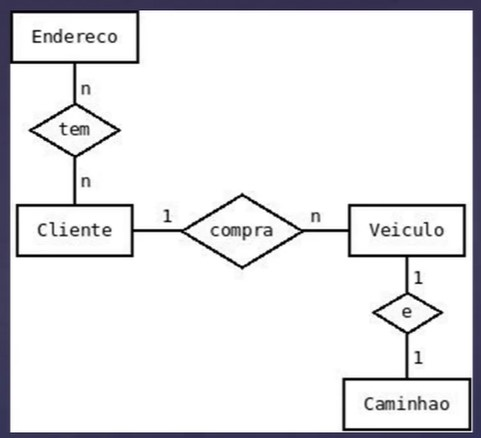
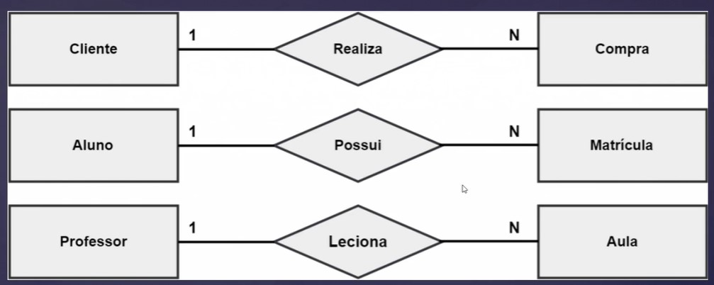
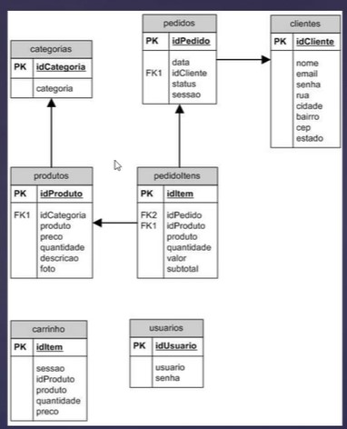
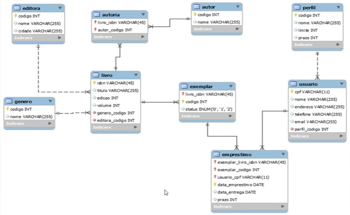

## Modelagem de Dados
Técnica utilizada para especificação da estrutura de dados do banco.

### Modelo Conceitual
Imagem que representa como você imagina que será o banco de dados. Possíveis Tabelas e Relação.

Cliente pode ter mais de uma compra.
Aluno pode possui matricula em mais de um curso.
Professor pode dar mais de uma aula.

A identificação será feita a partir do "**id**".

### Modelo Lógico

### Modelo Físico

## Tipos de Bancos de Dados

Os bancos de dados existentes são:
* Bancos de Dados Relacionais
* Bancos de Dados não relacionais

### Banco de Dados Relacional - MySQL
* Escalável
* Rápido
* Fácil integração com qualquer tecnologia Back-end
* Gratis
* Comunidade Enorma

### Banco de Dados Não Relacional - MongoDB
* Extremamente rápido
* Perfeito para aplicações grandes
* Normalmente Utilizado com NodeJS