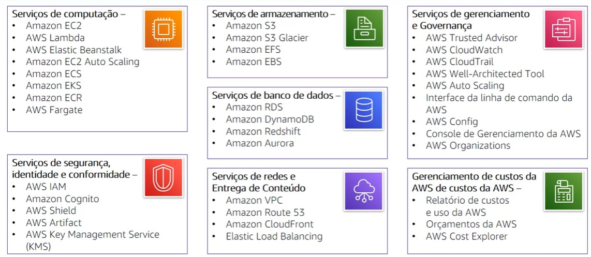

# Introdução à Amazon Web Services (AWS)

## O que é a AWS?
* AWS é uma plataforma de nuvem segura que oferece um amplo conjunto de produtos globais baseados em nuvem.
* Oferece acesso sob demanda a recursos de computação, armazenamento, rede, banco de dados e outros recursos de TI e ferramentas de gerenciamento.
* Oferece flexibilidade.
* Você paga apenas pelos serviços individuais de que precisa, pelo tempo que os utilizar. 

## Alguns Serviços

## Formas de interagir com a AWS
* Console de Gerenciamento da AWS
* Interface de linha de comando (CLI da AWS)
* Kits de desenvolvimento de software (SDKs)

# AWS Cloud Adoption Framewrok (AWS CAF)
 Perspectivas do AWS CAF:
 * Negócios
 * Pessoas
 * Governança
 * Plataforma
 * Segurança
 * Operações

Os tres primeiros tem um foco nos recursos empresariais e os três ultimso tem foco nos recursos técnicos. 
 As perspectivas podem reduzir pessoas, processos e tecnologias. 

